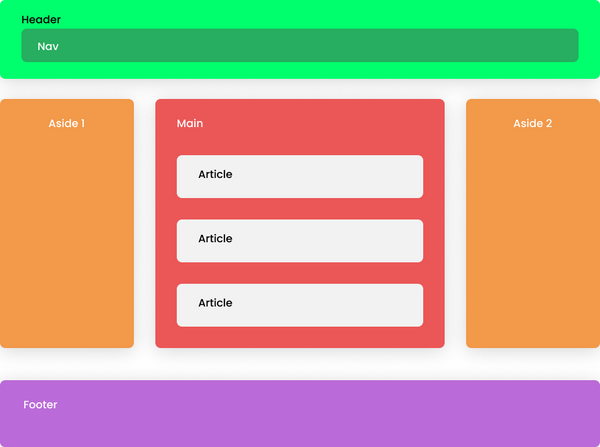

# Practicas modulo maquetado

## Practica 1

crear la siguiente estructura usando los tags de HTML 5.:

## Practica 2

Basado en la practica 1 realizar los estilos para que se vea de la siguiente manera:

## Practica 3

Desarrollar la pagina del siguiente link en html css:
https://www.frontendmentor.io/challenges/order-summary-component-QlPmajDUj